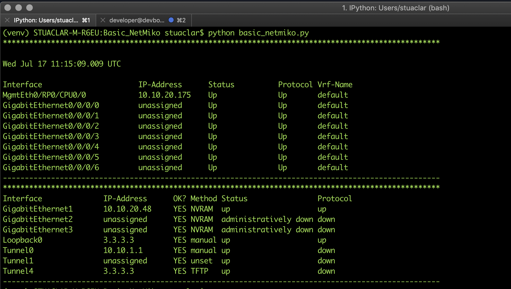

# Basic_NetMiko
Getting started with Netmiko using devnet always on Sandbox.

## Netmiko
Multi-vendor library to simplify Paramiko SSH connections to network devices, in this example we use the devnet always on sandbox for IOS XR and IOS XE - Netmiko Github page https://github.com/ktbyers/netmiko

[IOS XR Programmability Sandbox](https://devnetsandbox.cisco.com/RM/Diagram/Index/e83cfd31-ade3-4e15-91d6-3118b867a0dd?diagramType=Topology) - no reservation is required for this sandbox.

-[IOS XE on CSR Sandbox](https://devnetsandbox.cisco.com/RM/Diagram/Index/38ded1f0-16ce-43f2-8df5-43a40ebf752e?diagramType=Topology) - no reservation is required.

## Installation | Python Environment Setup
It is recommended that this code be used with Python 3.6. It is highly recommended to leverage Python Virtual Environments (venv).

Follow these steps to create and activate a venv.
```
# OS X or Linux
virtualenv venv --python=python3.6
source venv/bin/activate
```

To install netmiko, simply us pip and installed the requirements file

```
pip install -r requirements.txt
```

Netmiko has the following requirements (which pip will install for you)

- Paramiko >= 2.4.3
- scp >= 0.13.2
- pyyaml
- pyserial
- textfsm




## About me

Network Automation Developer Advocate for Cisco DevNet.
I'm like Hugh Hefner... minus the mansion, the exotic cars, the girls, the magazine and the money. So basically, I have a robe.

Find me here: [LinkedIn](https://www.linkedin.com/in/stuarteclark/) / [Twitter](https://twitter.com/bigevilbeard)
